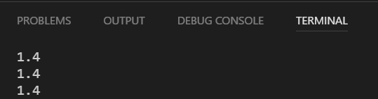

# timer

---

## Challenge

Print number of milliseconds elapsed since game started

  
* `pygame.init()`
* `pygame.time.get_ticks()` 
* Python `print` statement in while loop

---

## Answer on next slide

---

<code>

	    import pygame
	    pygame.init()

	    while True:
		    print(pygame.time.get_ticks())

</code>

---

## Challenge

Convert from millisecond to seconds

---

## Answer on next slide

---

<code>

	    import pygame
	    pygame.init()

	    while True:
		    print(pygame.time.get_ticks()/1000)
 
 </code>

---

## Challenge

Reduce floating point number to one decimal place.

* `round`

---

## Answer on next slide

---

<code>

    import pygame
    pygame.init()

    while True:
        timer_number = pygame.time.get_ticks() / 1000.0
        timer_one_decimal = round(timer_number, 1)
        print(timer_one_decimal)
		    
</code>

---

## Challenge

Convert time to string and assign to variable `timer_string`

---

## Challenge

Put timer on screen

---

## Hint on next slide

---

<code>

	timer_surface = timer_font.render("Time : " + timer_string, True, YELLOW)

	DISPLAY.blit(timer_surface, (0,0))

</code>

---

## Click Here for Next Challenge

