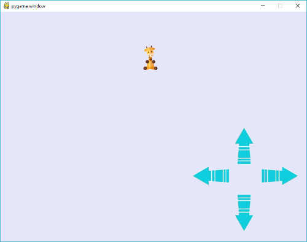

## Control

* Switch the cupcake to Guffy the giraffe
* Set up bounds detection
* Create virtual controller
* Change Guffy direction based on virtual controller

### Switch to Guffy

Insert this above the main while loop.

    giraffe = pygame.image.load('img/giraffe.png')
    giraffe_rect = pygame.Rect(0, 0, 64, 64)

The position of the giraffe needs to be specified by
a rectangle to enable collision detection with 
collideRect in the future.

### Move Guffy

#### What is the main while loop?
This is the main while loop.

    gameOn = True

    while gameOn:

#### Initially Guffy direction

Initially set Guffy's direction as down. Put this 
above the main while loop.

    direction = "down"

#### Guffy moves based on changing the `direction` variable

This must be in the main while loop.

    if direction == "down":
        giraffe_rect.centery += speed
    elif direction == "up":
        giraffe_rect.centery -= speed
    elif direction == "right":
        giraffe_rect.centerx += speed
    elif direction == "left":
        giraffe_rect.centerx -= speed

### Bounds detection

This must be in the main while loop.

    if giraffe_rect.bottom > 600:
        direction = "up"
    if giraffe_rect.top < 0:
        direction = "down"
    if giraffe_rect.left < 0:
        direction = "right"
    if giraffe_rect.right > 800:
        direction = "left"

### Virtual Controller

Above the main while loop.

    uarrow = pygame.image.load('img/arrows/up.png')
    uarrow_rect = pygame.Rect(610, 300, 55, 100)
    darrow = pygame.image.load('img/arrows/down.png')
    darrow_rect = pygame.Rect(610, 475, 55, 100)

Inside the main while loop.

    DISPLAY.blit(larrow, larrow_rect)
    DISPLAY.blit(uarrow, uarrow_rect)

### Change Guffy Direction Based on Controller

Look for the event for loop. Use an `if` statement
to check for a `pygame.MOUSEBUTTONDOWN event`.

    for event in pygame.event.get():
        if event.type == pygame.QUIT:
            gameOn = False
        if event.type == pygame.MOUSEBUTTONDOWN:
            mouse_pos = pygame.mouse.get_pos()
            if uarrow_rect.collidepoint(mouse_pos):
                direction = "up"
            if darrow_rect.collidepoint(mouse_pos):
                direction = "down"

## Answer

There is a complete code example in the answers section.

Prior to looking at the answer, review 
[these videos](https://www.youtube.com/playlist?list=PLxvyAnoL-vu5sNgzos6_v6nX-j8N4H-Pd) for tips.
