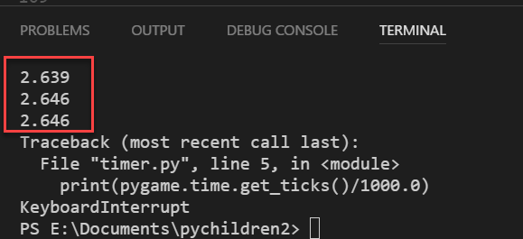

## Add Timer

### Display Text on Screen

To use fonts, you need three steps:

1. assign a variable to `pygame.font.Font`(*font name*, *font size*)
2. render font and assign it to variable_surface
3. blit rendered font to screen

Example
      
    timer_font = pygame.font.Font("font/animeace2_reg.ttf", 16)

In while loop.

    timer_surface = timer_font.render("Time: ", False, YELLOW)
    DISPLAY.blit(timer_surface, (0,0))

### Text Example

    import pygame

    pygame.init()

    SIZE = (800, 600)

    DISPLAY = pygame.display.set_mode(SIZE)
    YELLOW = (255, 255, 128)

    timer_font = pygame.font.Font("font/animeace2_reg.ttf", 24)

    gameOn = True

    while gameOn:
        for event in pygame.event.get():
            if event.type == pygame.QUIT:
                gameOn = False
        
        timer_surface = timer_font.render("Caitlyn", True, YELLOW)
        DISPLAY.blit(timer_surface, (0, 0))
        pygame.display.update()

### Time

You can get the time elapsed since the game was started 
with `pygame.time.get_ticks()`

#### Example use of `get_ticks()`

The example below does not bring up the the pygame window. It will only output text to the terminal. You must start your program from the terminal, not from the play button.

    import pygame
    pygame.init()

    while True:
        print(pygame.time.get_ticks())

To stop the program, press CTRL-c.

#### Convert from millisecond to seconds

`pygame.time.get_ticks()` will return 
a long number with a lot of digits. To make the number
shorter, divide it by 1000.0

    timer_number = pygame.time.get_ticks() / 1000.0

#### Example of getting time in seconds

    import pygame
    pygame.init()

    while True:
        print(pygame.time.get_ticks()/1000.0)

This will display elapsed time with too many decimal places.

#### Show only first decimal place

First, assign timer to a variable.

    import pygame
    pygame.init()

    while True:
        timer_number = pygame.time.get_ticks() / 1000.0
        print(timer_number)

You now need to round it the time to only one decimal place. 
Use the new python command `round`*(number, decimal places)*.

    import pygame
    pygame.init()

    while True:
        timer_number = pygame.time.get_ticks() / 1000.0
        timer_one_decimal = round(timer_number, 1)
        print(timer_one_decimal)

Before you can blit the time to the screen, you will need 
to convert the number into a string.

    timer_string = str(timer_one_decimal)

The complete code you need to get a string for the elapsed time with one 
decimal place is shown below.

    import pygame
    pygame.init()

    while True:
        timer_number = pygame.time.get_ticks() / 1000.0
        timer_one_decimal = round(timer_number, 1)
        print(timer_one_decimal)

#### Display Timer

You can now combine the pygame window that had the time with the 
timer string code.

    timer_surface = timer_font.render("Time : " + timer_string, True, YELLOW)
        
    DISPLAY.blit(timer_surface, (0,0))

Remember to blank out the screen each cycle before you blit elements.

