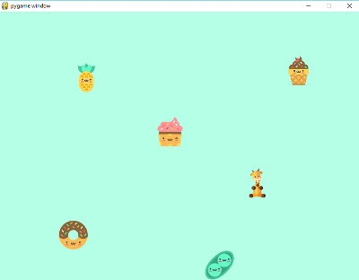

## Lesson 1: Image

> **IMPORTANT:** Before going through PyChildren2, go through the videos in the 
[original PyChildren](https://www.youtube.com/playlist?list=PLxvyAnoL-vu5sNgzos6_v6nX-j8N4H-Pd)

Create this

Using this code.

    import pygame

    SIZE = (800, 600)

    DISPLAY = pygame.display.set_mode(SIZE)

    gameOn = True

    while gameOn:
        for event in pygame.event.get():
            if event.type == pygame.QUIT:
                gameOn = False
        pygame.display.update()

### Load Image

    donut = pygame.image.load('img/donut.png')

Notes: 

- Load image above main while loop.

### Blit Image (Displays Image)

    DISPLAY.blit(donut, (131, 465))

Notes: 

- Must be in main while loop.

### Background Fill

    DISPLAY.fill(mint)

Notes: 

- must be above the images that are blitted to screen
- mint is a variable that is defined as rgb

Example:

    mint = (180,255,229)