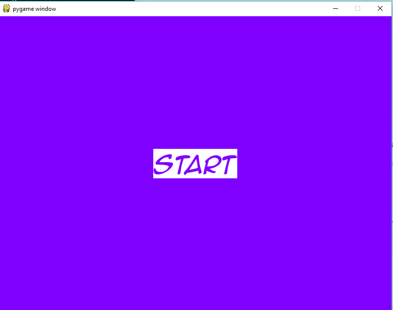
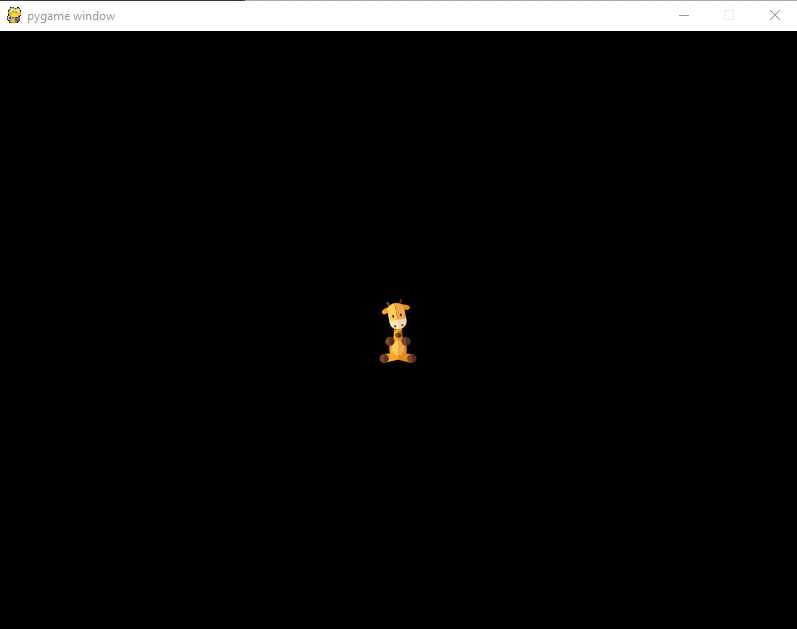

## Levels

Create two screens for your game.

### Create Start Screen
First, create a new game that looks like this.

Partial code above while loop

    PURPLE = (128, 0, 255)
    WHITE = (255, 255, 255)

    gameFont = pygame.font.Font('font/animeace2_ital.ttf', 48)
    startButton = gameFont.render("Start", True, PURPLE, WHITE)
    startRect = startButton.get_rect()
    startRect.center = DISPLAY.get_rect().center

### Create Game Screen

Copy your file from the start screen and save it with a new file name.
Modify the code so that your game looks like this.

### Set Up Level 0 for Start Screen

Above while loop.

    level = 0

Inside of while loop.

    if level == 0:
        DISPLAY.fill(PURPLE)
        DISPLAY.blit(startButton, startRect)

### Get Mouse Position for Button Press

Inside of event loop (`for event`)

    if event.type == pygame.MOUSEBUTTONDOWN:
        mousePos = pygame.mouse.get_pos()

### Switch from level 0 to level 1 

Inside of level 0 block (`if level == 0:`)

    if startRect.collidepoint(mousePos):
        level = 1

### Set up level 1 game block

Use `if level == 1:`.

### Full Code

    import pygame

    pygame.init()

    SIZE = (800, 600)

    DISPLAY = pygame.display.set_mode(SIZE)

    PURPLE = (128, 0, 255)
    WHITE = (255, 255, 255)
    BLACK = (0, 0, 0, 0)

    gameFont = pygame.font.Font('font/animeace2_ital.ttf', 48)
    startButton = gameFont.render("Start", True, PURPLE, WHITE)
    startRect = startButton.get_rect()
    startRect.center = DISPLAY.get_rect().center

    guffy = pygame.image.load("img/giraffe.png")
    guffyRect = guffy.get_rect(center=(400, 300))

    mousePos = (0, 0)

    level = 0

    gameOn = True

    while gameOn:
        for event in pygame.event.get():
            if event.type == pygame.QUIT:
                gameOn = False
            if event.type == pygame.MOUSEBUTTONDOWN:
                mousePos = pygame.mouse.get_pos()
        if level == 0:
            DISPLAY.fill(PURPLE)
            DISPLAY.blit(startButton, startRect)
            if startRect.collidepoint(mousePos):
                level = 1
        elif level == 1:
            DISPLAY.fill(BLACK)
            DISPLAY.blit(guffy, guffyRect)
        pygame.display.update()