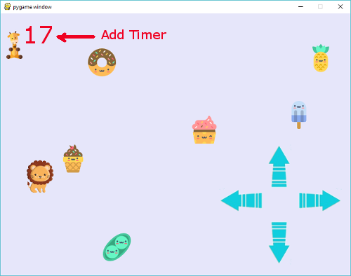

## Display Text on Screen

To use fonts, you need three steps:

1. assign a variable to `pygame.font.Font`(*font name*, *font size*)
2. render font and assign it to variable_surface
3. blit rendered font to screen

Example
      
    timer_font = pygame.font.Font("font/animeace2_reg.ttf", 16)

In while loop.

    timer_surface = timer_font.render("Time: ", False, YELLOW)
    DISPLAY.blit(timer_surface, (0,0))

### Text Example

    import pygame

    pygame.init()

    SIZE = (800, 600)

    DISPLAY = pygame.display.set_mode(SIZE)
    YELLOW = (255, 255, 128)

    timer_font = pygame.font.Font("font/animeace2_reg.ttf", 24)

    gameOn = True

    while gameOn:
        for event in pygame.event.get():
            if event.type == pygame.QUIT:
                gameOn = False
        
        timer_surface = timer_font.render("Caitlyn", True, YELLOW)
        DISPLAY.blit(timer_surface, (0, 0))
        pygame.display.update()

