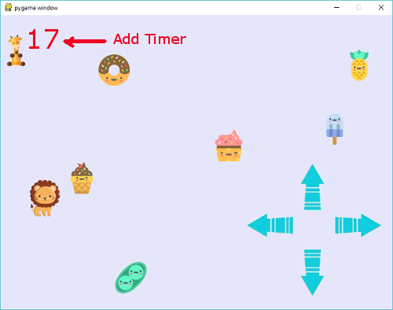

## Add Timer

### Text

Above while loop. Note download font from Internet if font is not already in the directory.

    ## initialize fonts
    timer_font = pygame.font.Font("font/animeace2_reg.ttf", 16)

In while loop.

    timer_surface = timer_font.render("Time : " + "17", False, YELLOW)
    windowSurface.blit(timer_surface, (0,0))

### Time

Set starting time. Above while loop.

    start_time = pygame.time.get_ticks()

[Documentation](https://www.pygame.org/docs/ref/time.html)

Calculate current time inside of while loop.

    current_time = pygame.time.get_ticks() - start_time

#### Convert from millisecond to string

    timer = current_time / 1000.0

Show only first decimal place
        
    timer = "{0:.1f}".format(timer)

[Documentation](https://www.digitalocean.com/community/tutorials/how-to-use-string-formatters-in-python-3)

#### Display Timer

    timer_surface = timer_font.render("Time : " + str(timer), False, YELLOW)
        
    windowSurface.blit(timer_surface, (0,0))