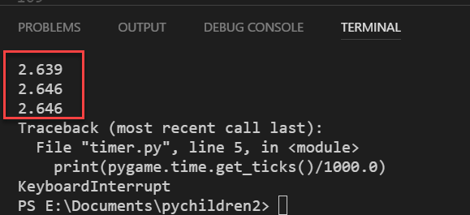
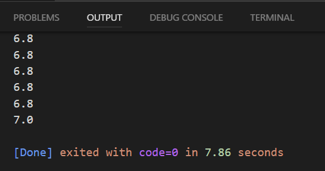

## Add Timer

### Text

To use fonts, you need three steps:

1. initialize fonts with pygame.font.Font(*font name*, *font size*)
2. render font
3. blit rendered font to screen

Example
      
    timer_font = pygame.font.Font("font/animeace2_reg.ttf", 16)

In while loop.

    timer_surface = timer_font.render("Time : " + "17", False, YELLOW)
    DISPLAY.blit(timer_surface, (0,0))

### Text Example

    import pygame

    pygame.init()

    SIZE = (800, 600)

    DISPLAY = pygame.display.set_mode(SIZE)
    YELLOW = (255, 255, 128)

    timer_font = pygame.font.Font("font/animeace2_reg.ttf", 24)

    gameOn = True

    while gameOn:
        for event in pygame.event.get():
            if event.type == pygame.QUIT:
                gameOn = False
        
        timer_surface = timer_font.render("Caitlyn", True, YELLOW)
        DISPLAY.blit(timer_surface, (0, 0))
        pygame.display.update()

### Time

Set starting time. Above while loop.

    start_time = pygame.time.get_ticks()

[Documentation](https://www.pygame.org/docs/ref/time.html)

#### Example use of `get_ticks()`

    import pygame

    pygame.init()

    clock = pygame.time.Clock()

    SIZE = (800, 600)

    DISPLAY = pygame.display.set_mode(SIZE)

    gameOn = True

    while gameOn:
        for event in pygame.event.get():
            if event.type == pygame.QUIT:
                gameOn = False
        print(pygame.time.get_ticks())
        pygame.display.update()

#### Calculate current time inside of while loop

    current_time = pygame.time.get_ticks() - start_time

#### Example of Current Time

    import pygame

    pygame.init()

    clock = pygame.time.Clock()

    SIZE = (800, 600)

    DISPLAY = pygame.display.set_mode(SIZE)

    start_time = pygame.time.get_ticks()

    gameOn = True

    while gameOn:
        for event in pygame.event.get():
            if event.type == pygame.QUIT:
                gameOn = False
        current_time = pygame.time.get_ticks() - start_time
        print(current_time)
        pygame.display.update()

#### Convert from millisecond to string

    timer = current_time / 1000.0

#### Example of getting time in seconds

    import pygame

    pygame.init()

    clock = pygame.time.Clock()

    SIZE = (800, 600)

    DISPLAY = pygame.display.set_mode(SIZE)

    start_time = pygame.time.get_ticks()

    gameOn = True

    while gameOn:
        for event in pygame.event.get():
            if event.type == pygame.QUIT:
                gameOn = False
        current_time = pygame.time.get_ticks() - start_time
        timer = current_time / 1000.0
        print(timer)
        pygame.display.update()

This will display elapsed time with too many decimal places.

#### Show only first decimal place
        
    timer = "{0:.1f}".format(timer)

[Documentation](https://www.digitalocean.com/community/tutorials/how-to-use-string-formatters-in-python-3)

#### Display Timer

    timer_surface = timer_font.render("Time : " + str(timer), False, YELLOW)
        
    DISPLAY.blit(timer_surface, (0,0))

